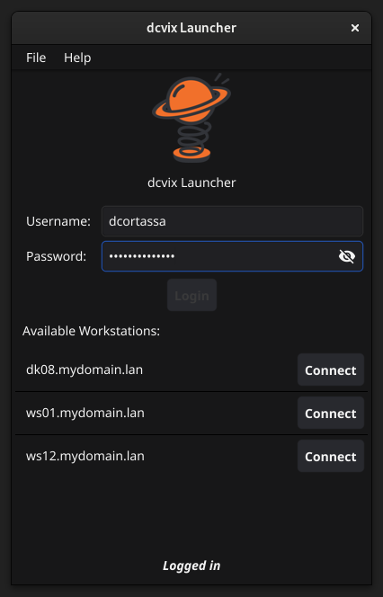
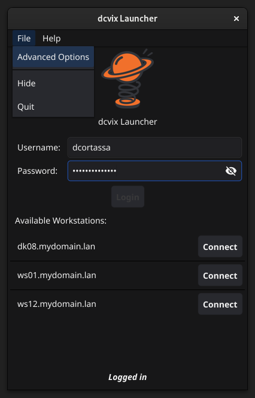
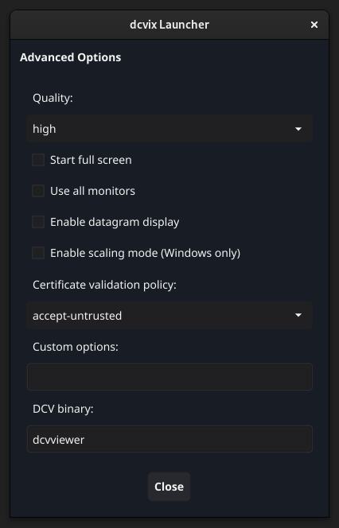

> [!WARNING]
> dcvix is under active development. Do not deploy in production environments unless you are prepared to handle incomplete features, breaking changes, and unexpected behavior.

  

dcvix is a session broker and server-pool manager for Amazon DCV. It provides centralized authentication, desktop session lifecycle management, and automatic allocation of DCV servers.
It consists of three components:
- The **director** runs on a central server and allows administrators to control desktop access and user authentication. It also acts as a token authenticator.
- The **agent** runs on workstations, collecting statistics and session information to be sent to the director. It responds to requests for session creation and termination.
- The **launcher** runs on the user's computer with a GUI. It authenticates users to obtain a security token, displays a list of DCV servers available to the user, and launches the DCV viewer.

dcvix Launcher
==============

A GUI client that runs on the
user's computer. It authenticates users against the director,
displays available DCV servers, and launches the DCV viewer.

A GUI client to connect to a DCV remote desktop in an infrastructure managed by dcvix.

Written in Go with the Fyne toolkit, it runs on Linux, Windows and macOS.

Full documentation is available at **[docs site](https://dcvix.github.io/)**.
